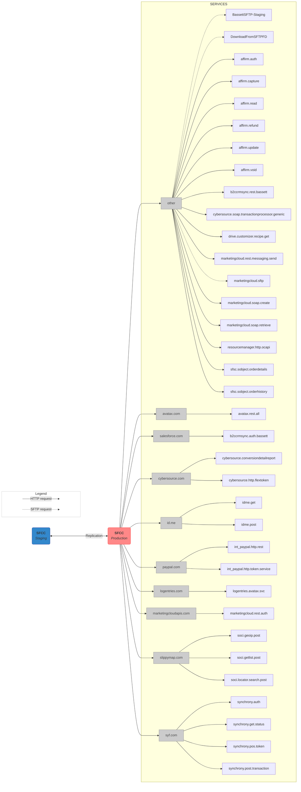

[ ← Back to Services](./index.md)
# Services diagram

This diagram is built using the services that are enabled, and groups them based on the domain for simplicity

```mermaid
flowchart LR

    STG("`**SFCC**
    _Staging_ `")

    PROD("`**SFCC**
    _Production_ `")

    STG <--> | Replication | PROD
    PROD --> other
    PROD --> avatax.com
    PROD --> salesforce.com
    PROD --> cybersource.com
    PROD --> id.me
    PROD --> paypal.com
    PROD --> logentries.com
    PROD --> marketingcloudapis.com
    PROD --> slippymap.com
    PROD --> syf.com


    subgraph SERVICES
        direction LR
        other:::service -.-> BassettSFTP-Staging
        other:::service -.-> DownloadFromSFTPFD
        other:::service --> affirm.auth
        other:::service --> affirm.capture
        other:::service --> affirm.read
        other:::service --> affirm.refund
        other:::service --> affirm.update
        other:::service --> affirm.void
        other:::service --> b2ccrmsync.rest.bassett
        other:::service --> cybersource.soap.transactionprocessor.generic
        other:::service --> drive.customizer.recipe.get
        other:::service --> marketingcloud.rest.messaging.send
        other:::service -.-> marketingcloud.sftp
        other:::service --> marketingcloud.soap.create
        other:::service --> marketingcloud.soap.retrieve
        other:::service --> resourcemanager.http.ocapi
        other:::service --> sfsc.sobject.orderdetails
        other:::service --> sfsc.sobject.orderhistory
        avatax.com:::service --> avatax.rest.all
        salesforce.com:::service --> b2ccrmsync.auth.bassett
        cybersource.com:::service --> cybersource.conversiondetailreport
        cybersource.com:::service --> cybersource.http.flextoken
        id.me:::service --> idme.get
        id.me:::service --> idme.post
        paypal.com:::service --> int_paypal.http.rest
        paypal.com:::service --> int_paypal.http.token.service
        logentries.com:::service --> logentries.avatax.svc
        marketingcloudapis.com:::service --> marketingcloud.rest.auth
        slippymap.com:::service --> soci.geoip.post
        slippymap.com:::service --> soci.getlist.post
        slippymap.com:::service --> soci.locator.search.post
        syf.com:::service --> synchrony.auth
        syf.com:::service --> synchrony.get.status
        syf.com:::service --> synchrony.pos.token
        syf.com:::service --> synchrony.post.transaction
    end

    subgraph Legend
        direction LR
        legendstart1[ ]:::legend -->| HTTP request | legendstop1[ ]:::legend
        legendstart2[ ]:::legend -.->| SFTP request | legendstop2[ ]:::legend
    end

    classDef service fill:#ccc,stroke:#888,color: #444
    classDef legend height:0px;
    style PROD fill:#f88,stroke:#f33
    style STG fill:#38c,stroke:#139
    style Legend fill:none, stroke:#ccc
```
